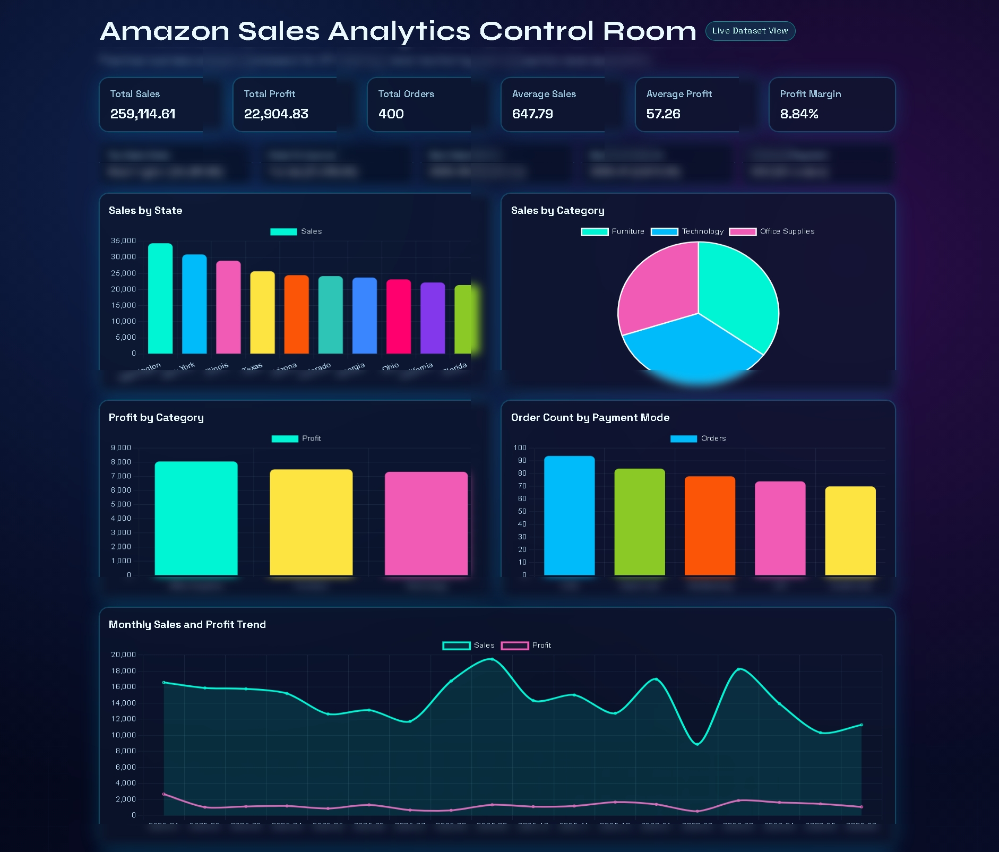
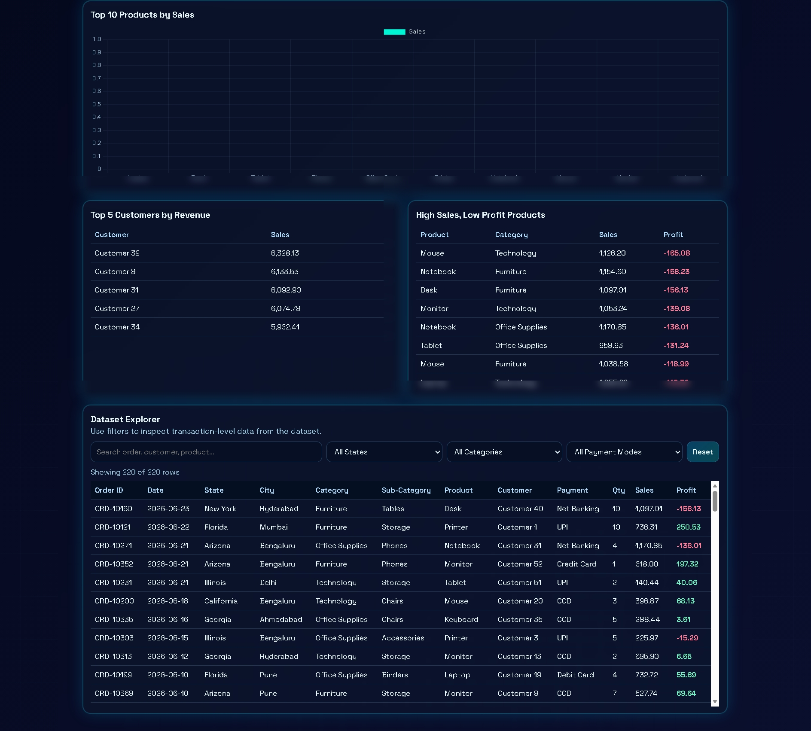

# Amazon Sales Analytics Control Room

A practical Amazon sales analysis project built with Flask, Pandas, and Chart.js.
This project combines transaction-level data analysis with an interactive dashboard experience for business decision-making.

## Core Highlights
- Practical KPI layer: Total Sales, Total Profit, Total Orders, Average Sales, Average Profit, Profit Margin.
- Business insight cards: Best/weak state, best sales month, best profit month, preferred payment mode.
- Interactive visual analysis:
  - Sales by State
  - Sales by Category
  - Profit by Category
  - Order Count by Payment Mode
  - Monthly Sales and Profit Trend
  - Top 10 Products by Sales
- Risk detection panel: High sales but low profit products.
- Top customer analysis panel.
- Dataset Explorer with search and filters (State, Category, Payment Mode).

## Practical Analytics Scope
### 2D Analytics Layer
- Chart-based business analysis for trend, comparison, composition, and ranking.
- KPI cards and tabular diagnostics for quick operational review.
- Filterable dataset table for drill-down and manual validation.

### 3D Visual Design Layer
- 3D-style neon depth using glow, layered cards, and glassmorphism treatment.
- Gradient atmosphere and spatial hierarchy for a control-room dashboard feel.
- Motion accents and elevated UI panels to improve readability and visual engagement.

## Screenshots
### Dashboard Overview

### Deep Analysis + Dataset Explorer

## Tech Stack
- Python
- Flask
- Pandas
- OpenPyXL
- Chart.js
- HTML/CSS/JavaScript

## Project Structure
- Amazon_Sales.xlsx
- Amazon_Sales_Analysis.ipynb
- app.py
- requirements.txt
- templates/index.html
- static/style.css

## Run Locally
1. Create/activate virtual environment.
2. Install dependencies:

   pip install -r requirements.txt

3. Start server:

   python app.py

4. Open:

   http://127.0.0.1:5000

## Business Questions Addressed
- What are total sales, total profit, total orders, and average order performance?
- Which state performs best and which state needs improvement?
- Which categories/products/customers contribute most to revenue?
- Which payment mode is most preferred?
- Which month has peak sales and peak profit?
- Which products show high sales but low profit risk?

## Recommendations Snapshot
1. Optimize margin on high-sales but low-profit products via pricing and discount control.
2. Improve low-performing states through targeted campaigns and logistics incentives.
3. Scale top-performing categories and products with focused customer retention offers.

## Author
Ashish Cherian
